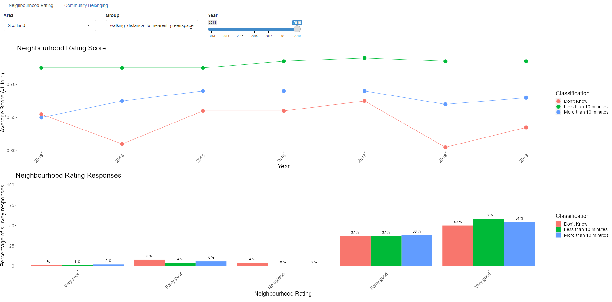

# Libraries and Data

### Libraries
```{r warning=FALSE, message=FALSE}
library(tidyverse)
library(here)
library(infer)
library(GGally)
library(sf)
```

### Data
```{r message=FALSE}
community_belonging <- read_csv(here("clean_data/community_belonging.csv")) %>% 
  mutate(community_belonging = factor(community_belonging, 
                                      levels = c("Not at all strongly", 
                                                 "Not very strongly",
                                                 "Don't know",
                                                 "Fairly strongly",
                                                 "Very strongly")))

neighbourhood_rating <- read_csv(here("clean_data/neighbourhood_rating.csv")) %>% 
  mutate(neighbourhood_rating = factor(neighbourhood_rating, 
                                      levels = c("Very poor", 
                                                 "Fairly poor",
                                                 "No opinion",
                                                 "Fairly good",
                                                 "Very good")))

council_boundaries <- st_read(
  dsn = here("clean_data/map_data/"),
  layer = "pub_las")

spatial_neighbourhood <- read_csv(here("clean_data/spatial_neighbourhood.csv")) 

spatial_neighbourhood_joined <- council_boundaries %>% 
   right_join(spatial_neighbourhood, by = join_by(code == feature_code))

spatial_community <- read_csv(here("clean_data/spatial_community.csv"))

spatial_community_joined <- council_boundaries %>% 
   right_join(spatial_community, by = join_by(code == feature_code))
```

### Functions
```{r}
source(here("analysis_scripts_and_functions/test_diff_in_means.R"))
source(here("analysis_scripts_and_functions/visualise_diff_in_means.R"))
source(here("analysis_scripts_and_functions/create_2019_graph.R"))
```

# 1. Background

## Scottish Household Survey

Every year the  asks a random selection of adults in private accommodation in Scotland questions about themselves and their household. This survey is run by Ipsos MORI on behalf of the Scottish Government.

This analysis and report will explore the responses given in this survey about neighbourhood ratings and community belonging, and how these are related to other factors such as access to green space, household type, and council area. The data available is from 2013-2019. Due to the COVID pandemic in 2020 the format of the survey had to change to telephone interview. Data from 2020 and 2021 has therefore been explored separately. 

## Data Sources:

* 
* 
* 

## Key terms

* social rented = (managed by public authorities and housing associations with support from the Scottish Government) 
* SIMD = Scottish Index of Multiple Depravation


**Neighbourhood rating**

The question asked by the survey is as follows:
>"THINKING NOW ABOUT THE NEIGHBOURHOOD YOU LIVE IN, HOW
WOULD YOU RATE IT AS A PLACE TO LIVE?
If pressed, define 'your neighbourhood' as: 'the street you live in and the
streets nearby' (urban) or 'the local area' (rural)."

The options given for the response were:
>"(1) Very good 
  (2) Fairly good 
  (3) Fairly poor 
  (4) Very poor 
  No opinion"
  
**Community Belonging**

The question asked by the survey is as follows:
>"HOW STRONGLY DO YOU FEEL YOU BELONG TO YOUR IMMEDIATE
NEIGHBOURHOOD?"

The options given for the response were:
>"(1) Very strongly
  (2) Fairly strongly
  (3) Not very strongly
  (4) Not at all strongly
  Don't know Spontaneous"

https://nationalperformance.gov.scot/national-outcomes/communities#:~:text=Our%20communities%20are%20shaped%20by,all%20who%20live%20in%20them.
https://www.gov.scot/policies/community-empowerment/
https://www.gov.scot/publications/local-living-20-minute-neighbourhoods-planning-guidance/pages/4/#:~:text=Local%20living%20and%2020%20minute%20neighbourhoods%20has%20an%20important%20role,and%20spaces%20for%20public%20life.

## Ethics

Since the results come from a random selection of the general population they may not be entirely representative. People that are not in private accommodation (eg. prisons, hospitals, student accommodation) will not be represented. Neither will those who refused to participate in the survey. This could lead to some bias in the results.

Since the data collected in the survey contains sensitive information, the data publicly available is highly aggregated. This limits the analysis which can be done, but ensures there is no risk of sensitive information of being shared within this report.

# 2. Data Cleaning and Exploration

To aid analysis each row of the data was given a score based on the percentage of people that gave that rating, and the rating itself coded with the following values:

**Neighbourhood Rating** 
- "Very poor"               -1
- "Fairly poor"             -0.5
- "No opinion"               0
- "Fairly good"              0.5
- "Very good"                1

**Community Belonging**
- "Not at all strongly"     -1
- "Not very strongly"       -0.5
- "Don't know"               0
- "Fairly strongly"          0.5
- "Very strongly"            1

## General Community Belonging and Neighbourhood Ratings across Scotland
```{r warning=FALSE}
ggplot(spatial_neighbourhood_joined, aes(fill = score)) +
  geom_sf() +
  scale_fill_distiller(palette = "PuBu", direction = 1) +
  theme_minimal() +
  theme(axis.text = element_blank(),
        panel.grid = element_blank()) +
  labs(
    title = "Average Neighbourhood Ratings",
    subtitle = "Scale is -1 to 1",
    fill = "Score"
  )
ggsave("neighbourhood_map.png")
```

```{r}
ggplot(spatial_community_joined, aes(fill = score)) +
  geom_sf() +
  scale_fill_distiller(palette = "PuBu", direction = 1) +
  theme_minimal() +
  theme(axis.text = element_blank(),
        panel.grid = element_blank()) +
  labs(
    title = "Average Community Belonging",
    subtitle = "Scale is -1 to 1",
    fill = "Score"
  )
ggsave("community_map.png")
```

## Top Rated Areas
The highest neighbourhood ratings are found in the Outer Hebrides, Orkney, and Shetland.

```{r message=FALSE}
top_10_neighbourhood <- neighbourhood_rating %>% 
  filter(measurement == "Percent", gender != "All") %>% 
  group_by(feature_code, area, year, gender) %>% 
  summarise(total_score = sum(score)) %>% 
  group_by(area) %>% 
  summarise(avg_neighbourhood_score = mean(total_score)) %>% 
  slice_max(avg_neighbourhood_score, n = 10)
top_10_neighbourhood

top_10_community <- community_belonging %>% 
  filter(measurement == "Percent", gender != "All") %>% 
  group_by(feature_code, area, year, gender) %>% 
  summarise(total_score = sum(score)) %>% 
  group_by(area) %>% 
  summarise(avg_community_score = mean(total_score)) %>% 
  slice_max(avg_community_score, n = 10)
top_10_community
```
Those that have high neighbourhood ratings and community belonging:
```{r}
top_10_community %>% 
  inner_join(top_10_neighbourhood)
```

Shiny app exploration

An app was created to explore both the overall rating over the years, and distribution of ratings within each year. The data can be explored across the different council areas, as well as the different categories provided. The app has two tabs, one for neighbourhood rating and one for community belonging.

An example output from the app:


### Outer Hebrides (Na h-Eileanan Siar)

The key features of those surveyed from 2013 to 2019 in the Outer Hebrides are:

* Within less than 10 minutes walking distance to greenspace
* White (ethnicity)
* Home owners or social rented
* In the 80% least deprived category

Interesting findings include:

Since 2017 a higher percentage of people in **rural** areas have said their neighbourhood was "Very good" compared to those in urban areas. Community belonging was also higher in rural areas across all but 1 year. The percentage of people that feel "Very strongly" that they belong to their local neighbourhood is considerably higher in rural areas and this has been increasing since 2015.

A higher percentage of people in **owned properties** also said that their neighbourhood was "Very good" and that they felt "Very strongly" that they belong to their neighbourhood compared to those in social rented accommodation.

Similarly, a higher percentage of **pensioners** voted rated their neighbourhood and community belonging the highest option compared to households with adults or with children, and tended to rate both higher as a whole.

### Orkney Islands

Those surveyed were:

* In the 80% least deprived
* White
* Home owners

Interesting findings include:

Overall **females** gave higher ratings of both neighbourhood ratings and community belonging.

Although **rural** areas tended to be rated higher for both neighbourhood ratings and community belonging, urban areas had a higher overall rating for community belonging in 2019, and the average neighbourhood ratings were higher for urban areas in 2016, 2018, and 2019.

**Pensioners** consistently scored their neighbourhoods and community belonging higher than other groups. In 2019 71% of pensioners surveyed felt "Very strongly" that they belonged to their local neighbourhood. Only 44% and 36% of households with only adults, and households with children respectively rated their community belonging "Very strongly".

The average rating significantly dropped in 2019 compared to previous years.

### Shetland Islands

Those surveyed were:

* In the 80% least deprived
* White
* Within less than 10 minutes walking distance of greenspace

People in **rural** areas consistently rated their neighbourhood  and community belonging much higher, and were much more likely to rate their neighbourhoods as "Very good", and community belonging as "Very strongly" compared to those in urban areas.

Those who **own their homes** give higher ratings for both neighbourhood ratings and community belonging, and are more likely to rate their neighbourhoods "Very good". No one from rented properties were surveyed in 2018 or 2019.

In general **pensioners** were more likely to give their neighbourhood a higher rating, and have consistently felt stronger community belonging than other groups surveyed.

*Note:* Is this survey bias or representative of these areas?

## Bottom Rated areas
```{r}
bottom_10_neighbourhood <- neighbourhood_rating %>% 
  filter(measurement == "Percent", gender != "All") %>% 
  group_by(feature_code, area, year, gender) %>% 
  summarise(total_score = sum(score)) %>% 
  group_by(area) %>% 
  summarise(avg_neighbourhood_score = mean(total_score)) %>% 
  slice_min(avg_neighbourhood_score, n = 12)
bottom_10_neighbourhood

bottom_10_community <- community_belonging %>% 
  filter(measurement == "Percent", gender != "All") %>% 
  group_by(feature_code, area, year, gender) %>% 
  summarise(total_score = sum(score)) %>% 
  group_by(area) %>% 
  summarise(avg_community_score = mean(total_score)) %>% 
  slice_min(avg_community_score, n = 12)
bottom_10_community
```
```{r}
bottom_10_community %>% 
  inner_join(bottom_10_neighbourhood)
```
### Dundee City

* Urban
* White
* Less than 10 minutes from greenspace (all but 2 years)

Low ratings from: 

* 20% most deprived
* private and social rented
* adult only households
* males
* more than 10 minutes from greenspace

External findings:

* Lower life expectancy than Scotland


### Aberdeen City

* Urban
* Least deprived
* White

Low ratings from: 
* social rented (followed by private rented)
* males
* more than 10 minutes from greenspace
* adults and children (not pensioners)

### Glasgow City

* Urban

Low ratings from: 
* 20% most deprived
* non-white ethnicities (community belonging only)
* private rented (community) / social rented (neighbourhood)
* adults and children (not pensioners)
* more than 10 minutes from greenspace
* males (community) / females (neighbourhood)

## Change

```{r}
ggplot(spatial_neighbourhood_joined, aes(fill = diff)) +
  geom_sf() +
  #scale_fill_distiller(palette = "3-class PiYG", type = "div") +
  scale_fill_gradient2(low = "#e9a3c9", mid = "#f7f7f7", high = "#a1d76a") +
  theme_minimal() +
  theme(axis.text = element_blank())

ggplot(spatial_community_joined, aes(fill = diff)) +
  geom_sf() +
  #scale_fill_distiller(palette = "3-class PiYG", type = "div") +
  scale_fill_gradient2(low = "#e9a3c9", mid = "#f7f7f7", high = "#a1d76a") +
  theme_minimal() +
  theme(axis.text = element_blank())
```
```{r}
spatial_community_joined %>% 
  as.data.frame() %>% 
  select(local_auth, diff) %>% 
  slice_max(diff, n = 10) %>% 
  mutate(diff = diff * 100)

spatial_community_joined %>% 
  as.data.frame() %>% 
  select(local_auth, diff) %>% 
  slice_min(diff, n = 10) %>% 
  mutate(diff = diff * 100)
```
```{r}
spatial_community_joined %>% 
  as.data.frame() %>% 
  select(local_auth, diff) %>% 
  filter(local_auth == "West Dunbartonshire")
```
```{r}
spatial_neighbourhood_joined %>% 
  as.data.frame() %>% 
  select(local_auth, diff) %>% 
  slice_max(diff, n = 10) %>% 
  mutate(diff = diff * 100)

spatial_neighbourhood_joined %>% 
  as.data.frame() %>% 
  select(local_auth, diff) %>% 
  slice_min(diff, n = 10) %>% 
  mutate(diff = diff * 100)
```

```{r}
spatial_neighbourhood_joined %>% 
  as.data.frame() %>% 
  select(local_auth, diff) %>% 
  filter(local_auth == "Glasgow City")
```

A shiny app was created to help explore the data in an interactive way. This will be referred to here and can be found within the `explanatory_app` folder of this repository.

# 3. Does access to greenspace impact neighbourhood ratings or community belonging?

```{r}
create_2019_graph_neighbourhood(walking_distance_to_nearest_greenspace)
```
Generally people rated their neighbourhood fairly highly. At least 50% of people in each group rated their neighbourhood as "Very good".

Those that had access to green space within less than 10 minutes of walking appear to be slightly more likely to rate their neighbourhood "Very good" compared to the other groups. People who do not know how close their nearest greenspace is were more likely than the other groups to have no opinion on the neighbourhood, or rate it "Fairly poor". This pattern is fairly consistent across the years analysed.

```{r}
neighbourhood_rating %>% 
      filter(area == "Scotland", measurement == "Percent",
             walking_distance_to_nearest_greenspace != "All") %>% 
      summarise(total_score = sum(score),
                .by = c(year, walking_distance_to_nearest_greenspace)) %>% 
      ggplot(aes(year, total_score, colour = walking_distance_to_nearest_greenspace)) +
      geom_line() +
      geom_point() +
      scale_x_continuous(breaks = seq(2013, 2019, 1)) +
      theme(axis.text.x = element_text(angle = 45, hjust = 1),
            panel.grid.major = element_blank(),
            panel.grid.minor = element_blank(),
            panel.background = element_blank(),
            text = element_text(size = 16)) +
      labs(
        title = "Neighbourhood Rating Score",
        x = "Year",
        y = "Total Score (-1 to 1)",
        colour = "Walking Distance To\nNearest Greenspace"
      )
```

_This means....._

```{r}
create_2019_graph_community(walking_distance_to_nearest_greenspace)
```
_This means..._

## Conclusions

* Those who did not know how far to their nearest greenspace tended to rate their feelings of community belonging lower. 
* Those with a greenspace within 10 minutes walking tended to rate their neighbourhoods, and feeling of community belonging slightly higher than those that didn't. 
* Increasing access to greenspace may help to increase neighbourhood ratings and community belonging.

# 4. Which other factors influence neighbourhood ratings and community belonging?

## Type of Tenure

```{r}
create_2019_graph_neighbourhood(type_of_tenure)
```

```{r}
create_2019_graph_community(type_of_tenure)
```

