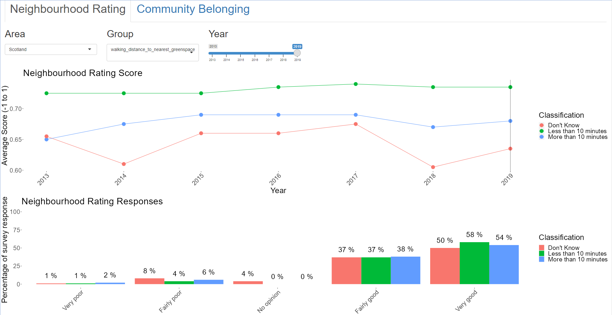

# Libraries and Data

### Libraries
```{r warning=FALSE, message=FALSE}
library(tidyverse)
library(here)
library(infer)
library(GGally)
library(sf)
```

### Data
```{r message=FALSE}
# cleaned community belonging
community_belonging <- read_csv(here("clean_data/community_belonging.csv")) %>% 
  mutate(community_belonging = factor(community_belonging, 
                                      levels = c("Not at all strongly", 
                                                 "Not very strongly",
                                                 "Don't know",
                                                 "Fairly strongly",
                                                 "Very strongly")))

# cleaned neighbourhood rating
neighbourhood_rating <- read_csv(here("clean_data/neighbourhood_rating.csv")) %>% 
  mutate(neighbourhood_rating = factor(neighbourhood_rating, 
                                       levels = c("Very poor", 
                                                  "Fairly poor",
                                                  "No opinion",
                                                  "Fairly good",
                                                  "Very good")))

# geometries of council boundaries in scotland
council_boundaries <- st_read(
  dsn = here("clean_data/map_data/"),
  layer = "pub_las")

# aggregated neighbourhood rating data
spatial_neighbourhood <- read_csv(here("clean_data/spatial_neighbourhood.csv")) 

# join with council boundaries
spatial_neighbourhood_joined <- council_boundaries %>% 
  right_join(spatial_neighbourhood, by = join_by(code == feature_code))

# aggregated community belonging data
spatial_community <- read_csv(here("clean_data/spatial_community.csv"))

# join with council boundaries
spatial_community_joined <- council_boundaries %>% 
  right_join(spatial_community, by = join_by(code == feature_code))

# full results from 2019 survey
data_2019 <- read_csv(here("clean_data/full_2019_responses.csv")) %>% 
  mutate(
    greenspace = factor(greenspace, levels = c(
    "5 mins or less",
    "6-10 mins",
    "11-20 mins",
    "21-30 mins",
    "More than 30",
    "Don't know")),
    community_belonging = factor(community_belonging,
                                 levels = c("Don't know",
                                            "Not at all strongly",
                                            "Not very strongly",
                                            "Fairly strongly",
                                            "Very strongly")),
    neighbourhood_rating = factor(neighbourhood_rating,
                                  levels = c("No opinion",
                                             "Very poor",
                                             "Fairly poor",
                                             "Fairly good",
                                             "Very good")),
    community_score = case_when(
      community_belonging == "Don't know" ~ 0,
      community_belonging == "Not at all strongly" ~ 1,
      community_belonging == "Not very strongly" ~ 2,
      community_belonging == "Fairly strongly" ~ 3,
      community_belonging == "Very strongly" ~ 4
    ),
    simd = factor(simd),
    neighbourhood_score = case_when(
      neighbourhood_rating == "No opinion" ~ 0,
      neighbourhood_rating == "Very poor" ~ 1,
      neighbourhood_rating == "Fairly poor" ~ 2,
      neighbourhood_rating == "Fairly good" ~ 3,
      neighbourhood_rating == "Very good" ~ 4
    )
  ) %>% 
  mutate(across(where(is.character), as.factor))
```

```{r}
# Proportion of different groups in each council area, joined with the spatial data
prop_per_council <-
  data_2019 %>% 
  group_by(council) %>% 
  mutate(white = if_else(ethnicity == "White", 1, 0),
         simd = as.integer(simd),
         urban = if_else(urban_rural == "Urban", 1, 0),
         adult = if_else(household_type == "Adult", 1, 0),
         pensioner = if_else(household_type == "Pensioner", 1, 0),
         children = if_else(household_type == "Children", 1, 0),
         female = if_else(gender == "Female", 1, 0),
         owned = case_when(str_detect(tenure, "Owned") ~ 1, .default = 0),
         social_rent = if_else(tenure == "Social Rented", 1, 0),
         private_rent = if_else(tenure == "Private Rented", 1, 0),
  ) %>% 
  summarise(age = mean(randage),
            prop_white = mean(white),
            simd = mean(simd),
            prop_urban = mean(urban),
            prop_adult = mean(adult),
            prop_child = mean(children),
            prop_pensioner = mean(pensioner),
            prop_female = mean(female),
            prop_owned = mean(owned),
            prop_social_rent = mean(social_rent),
            prop_private_rent = mean(private_rent)
  )

spatial_neighbourhood_full <- spatial_neighbourhood_joined %>% 
  left_join(prop_per_council, by = join_by(local_auth == council))
```


### Functions
```{r}
source(here("analysis_scripts_and_functions/test_diff_in_means.R"))
source(here("analysis_scripts_and_functions/visualise_diff_in_means.R"))
source(here("analysis_scripts_and_functions/create_2019_graph.R"))

plot_scores <- function(category, title_wording = "Average Community Belonging"){
  data_2019 %>% 
    group_by(council, {{category}}) %>% 
    summarise(average_score = mean(community_score)) %>% 
    ggplot(aes({{category}}, average_score)) +
    geom_boxplot() +
    theme_light() +
    labs(
      title = str_c("Community Belonging by ", title_wording),
      y = "Average Community Belonging Score",
      x = title_wording
    )
}

plot_scotland <- function(category){
  spatial_neighbourhood_full %>% 
    ggplot(aes(fill = {{category}}, colour = score)) +
    geom_sf() +
  scale_color_distiller(palette = "RdYlGn", direction = 1) +
  scale_fill_distiller(palette = "Greys", direction = 1)
}
```

# 1. Background

## Scottish Household Survey

Every year the  asks a random selection of adults in private accommodation in Scotland questions about themselves and their household. This survey is run by Ipsos MORI on behalf of the Scottish Government.

This analysis and report will explore the responses given in this survey about neighbourhood ratings and community belonging, and how these are related to other factors such as access to green space, household type, and council area. The data available is from 2013-2019. Due to the COVID pandemic in 2020 the format of the survey had to change to telephone interview. Data from 2020 and 2021 has therefore been explored separately. 

## Data Sources:

**Internal Data**

* Excel file on community belonging, available at `statistics.gov.scot`, 
* Excel file on neighbourhood rating, available at `statistics.gov.scot`, 
* Excel file of all 2019 responses, available through UK Data Service, , *while this was sourced externally, it is data directly from the Scottish Government just shared through a secure site*.

**External Data**
* Excel file on the council area codes, available from Public Health Scotland at `opendata.nhs.scot`,  
* Tab data for geographical information on council areas, available from `data.spatialhub.scot`, 


FIX!
* 
* 
* 
* 


## Key terms

* social rented = (managed by public authorities and housing associations with support from the Scottish Government) 
* SIMD = Scottish Index of Multiple Deprivation


**Neighbourhood rating**

The question asked by the survey is as follows:
>"THINKING NOW ABOUT THE NEIGHBOURHOOD YOU LIVE IN, HOW
WOULD YOU RATE IT AS A PLACE TO LIVE?
If pressed, define 'your neighbourhood' as: 'the street you live in and the
streets nearby' (urban) or 'the local area' (rural)."

The options given for the response were:
>"(1) Very good 
(2) Fairly good 
(3) Fairly poor 
(4) Very poor 
No opinion"

**Community Belonging**

The question asked by the survey is as follows:
>"HOW STRONGLY DO YOU FEEL YOU BELONG TO YOUR IMMEDIATE
NEIGHBOURHOOD?"

The options given for the response were:
>"(1) Very strongly
(2) Fairly strongly
(3) Not very strongly
(4) Not at all strongly
Don't know Spontaneous"

https://nationalperformance.gov.scot/national-outcomes/communities#:~:text=Our%20communities%20are%20shaped%20by,all%20who%20live%20in%20them.
https://www.gov.scot/policies/community-empowerment/
https://www.gov.scot/publications/local-living-20-minute-neighbourhoods-planning-guidance/pages/4/#:~:text=Local%20living%20and%2020%20minute%20neighbourhoods%20has%20an%20important%20role,and%20spaces%20for%20public%20life.

## Ethics

Since the results come from a random selection of the general population they may not be entirely representative. People that are not in private accommodation (eg. prisons, hospitals, student accommodation) will not be represented. Neither will those who refused to participate in the survey. This could lead to some bias in the results.

Since the data collected in the survey contains sensitive information, the data publicly available is highly aggregated. This limits the analysis which can be done, but ensures there is no risk of sensitive information of being shared within this report.

# 2. Data Cleaning and Exploration

To aid analysis each row of the data was given a score based on the percentage of people that gave that rating, and the rating itself coded with the following values:

**Neighbourhood Rating** 
- "Very poor"               -1
- "Fairly poor"             -0.5
- "No opinion"               0
- "Fairly good"              0.5
- "Very good"                1

**Community Belonging**
- "Not at all strongly"     -1
- "Not very strongly"       -0.5
- "Don't know"               0
- "Fairly strongly"          0.5
- "Very strongly"            1

## General Community Belonging and Neighbourhood Ratings across Scotland

### Community Belonging in the Whole of Scotland
```{r}
data_2019 %>% 
  filter(!is.na(community_belonging)) %>% 
  group_by(community_belonging) %>% 
  summarise(prop = round(n()/nrow(data_2019)*100, 0)) %>% 
  ggplot(aes(community_belonging, prop)) +
  geom_col(fill = "blue") +
  geom_text(aes(label = paste(prop, "%")),
            vjust = -1, position = position_dodge(0.9)) +
  scale_y_continuous(limits = c(0, 47)) +
  labs(
    title = "Community Belonging in Scotland 2019",
    x = "Community Belonging",
    y = "Proportion of Responses (%)"
  ) +
  theme_light() +
  theme(text = element_text(size = 14))
```
Feelings of community belonging are fairly high in Scotland with 80% of people rating it "Fairly" or "Very" strongly.

```{r message=FALSE}
plot_scores(simd, "SIMD")
plot_scores(urban_rural, "Urban or Rural")
plot_scores(household_type, "Household Type")
plot_scores(gender, "Gender")
plot_scores(tenure, "Type of Tenure")
plot_scores(greenspace, "Distance to Greenspace")
```

* Community belonging increases with a higher SIMD (less deprived). The most improvement could be seen in lower SIMD areas.  
* Community belonging is higher in rural areas compared to urban areas. The focus should be on improving community belonging in urban areas.  
* Pensioners have higher community belonging than households with children or working age adults. Families and working age adults should be the focus of improving community belonging.  
* Females in general feel slightly more community belonging. The reasons for this could be explored to improve community belonging for men also.  
* Those that own their properties feel higher community belonging than those in social rented accommodation. Efforts could be focussed on areas with high social renting numbers.   
* Only 1% of the data was from private rented accommodation which is not sufficient to draw conclusions from.
* Greenspace does not appear to have a significant impact on community belonging.

### Neighbourhood Ratings in the Whole of Scotland
```{r}
data_2019 %>% 
  filter(!is.na(neighbourhood_rating)) %>% 
  group_by(neighbourhood_rating) %>% 
  summarise(prop = round(n()/nrow(data_2019)*100, 0)) %>% 
  ggplot(aes(neighbourhood_rating, prop)) +
  geom_col(fill = "blue") +
  geom_text(aes(label = paste(prop, "%")),
            vjust = -1, position = position_dodge(0.9))+
  scale_y_continuous(limits = c(0, 65)) +
  labs(
    title = "Neighbourhood Ratings in Scotland 2019",
    x = "Neighbourhood Ratings",
    y = "Proportion of Responses (%)"
  ) +
  theme_light() +
  theme(text = element_text(size = 14))
```
Neighbourhood ratings are even higher with almost 60% of people rating their local neighbourhood "Very good", and only 5% rating their neighbourhood "Fairly" or "Very" poor.


```{r warning=FALSE}
plot_neighbourhood <- function(category, title_wording = "Average Neighbourhood Rating"){
  data_2019 %>% 
    group_by(council, {{category}}) %>% 
    summarise(average_score = mean(neighbourhood_score)) %>% 
    ggplot(aes({{category}}, average_score)) +
    geom_boxplot() +
    theme_light() +
    labs(
      title = str_c("Neighbourhood Rating by ", title_wording),
      y = "Average Neighbourhood Rating Score",
      x = title_wording
    )
}
```

```{r message=FALSE}
plot_neighbourhood(simd, "SIMD")
plot_neighbourhood(urban_rural, "Urban or Rural")
plot_neighbourhood(household_type, "Household Type")
plot_neighbourhood(gender, "Gender")
plot_neighbourhood(tenure, "Type of Tenure")
plot_neighbourhood(greenspace, "Distance to Greenspace")
```

* Neighbourhood Ratings increase with SIMD (decreasing depravity), lower SIMD areas should be targeted.  
* Rural areas have a higher average neighbourhood rating. Urban areas should be the priority for improving neighbourhoods.  
* Pensioner households have a marginally higher average neighbourhood rating than other household types.  
* Males and females gave fairly similar neighbourhood ratings.  
* Those in social renting rated their neighbourhoods lower than home owners. Areas with high levels of social renting should be the priority for improving neighbourhoods.
* Increasing distance to greenspace does not have a significant impact on neighbourhood ratings.

### Community Belonging Within Council Areas in Scotland
```{r}
ggplot(spatial_community_joined, aes(fill = score)) +
  geom_sf() +
  scale_fill_distiller(palette = "PuBu", direction = 1) +
  theme_minimal() +
  theme(axis.text = element_blank(),
        panel.grid = element_blank()) +
  labs(
    title = "Average Community Belonging",
    subtitle = "Scale is -1 to 1",
    fill = "Score"
  )
#ggsave("community_map.png")
```

```{r message=FALSE}
top_10_community <- data_2019 %>% 
  mutate(simd = as.numeric(simd),
         urban = if_else(urban_rural == "Urban", 1, 0)) %>% 
  group_by(council) %>% 
  summarise(avg_community_score = mean(community_score),
            #avg_neighbourhood_score = mean(neighbourhood_score),
            prop_urban = mean(urban)) %>%  
  slice_max(avg_community_score, n = 10) %>% 
  rename("Top Rated Areas" = council) %>% 
  rename("Average Community Score" = avg_community_score) %>% 
  #rename("Average Neighbourhood Score" = avg_neighbourhood_score) %>% 
  rename("Proportion of Urban Responses" = prop_urban)
top_10_community

bottom_10_community <- data_2019 %>% 
  mutate(simd = as.numeric(simd),
         urban = if_else(urban_rural == "Urban", 1, 0)) %>% 
  group_by(council) %>% 
  summarise(avg_community_score = mean(community_score),
            #avg_neighbourhood_score = mean(neighbourhood_score),
            prop_urban = mean(urban)) %>% 
  slice_min(avg_community_score, n = 10) %>% 
  rename("Lowest Rated Areas" = council) %>% 
  rename("Average Community Score" = avg_community_score) %>% 
  #rename("Average Neighbourhood Score" = avg_neighbourhood_score) %>% 
  rename("Proportion of Urban Responses" = prop_urban) 
bottom_10_community
```
Some of the best areas for community belonging are the Outer Hebrides (Eilean Siar), Orkney and Shetland. These areas are rural, isolated communities. They are in the top 5 council areas for life expectancy (Life Expectancy in Scotland, 2019-2021 Report, ).

Those that rate their community belonging lowest tend to be more urban areas.

### Neighbourhood Ratings Within Council Areas in Scotland
```{r warning=FALSE}
ggplot(spatial_neighbourhood_joined, aes(fill = score)) +
  geom_sf() +
  scale_fill_distiller(palette = "PuBu", direction = 1) +
  theme_minimal() +
  theme(axis.text = element_blank(),
        panel.grid = element_blank()) +
  labs(
    title = "Average Neighbourhood Ratings",
    subtitle = "Scale is -1 to 1",
    fill = "Score"
  )
#ggsave("neighbourhood_map.png")
```

```{r message=FALSE}
top_10_neighbourhood <- data_2019 %>% 
  mutate(simd = as.numeric(simd),
         urban = if_else(urban_rural == "Urban", 1, 0)) %>% 
  group_by(council) %>% 
  summarise(avg_neighbourhood_score = mean(neighbourhood_score),
            prop_urban = mean(urban)) %>% 
  slice_max(avg_neighbourhood_score, n = 10) %>% 
  rename("Average Neighbourhood Rating" = avg_neighbourhood_score) %>% 
  rename("Top Rated Areas" = council) %>% 
  rename("Proportion of Urban Responses" = prop_urban)
top_10_neighbourhood

bottom_10_neighbourhood <- data_2019 %>% 
  mutate(simd = as.numeric(simd),
         urban = if_else(urban_rural == "Urban", 1, 0)) %>% 
  group_by(council) %>% 
  summarise(avg_neighbourhood_score = mean(neighbourhood_score),
            prop_urban = mean(urban)) %>%  
  slice_min(avg_neighbourhood_score, n = 10) %>% 
  rename("Average Neighbourhood Rating" = avg_neighbourhood_score) %>% 
  rename("Lowest Rated Areas" = council) %>% 
  rename("Proportion of Urban Responses" = prop_urban)
bottom_10_neighbourhood
```
The lowest rated areas all have a proportion of urban responses greater than 85%.

Those with higher community belonging tend to also rate their neighbourhood higher:

```{r message=FALSE}
top_10_community %>% 
  inner_join(top_10_neighbourhood)
```
There is a much clearer distinction with neighbourhoods in urban areas around the central belt receiving lower average ratings than rural areas, and the north.

East Renfrewshire would be an interesting area to look into further as it has a very high proportion of people from urban locations and yet is in the top 10 for both community belonging and neighbourhood ratings.

## General Characteristics of Highest and Lowest Rated Areas.

The aggregated data was first explored through an R Shiny app.

This allows exploration of both the overall neighbourhood rating, or community belonging over the years, as well as the distribution of ratings within each year. The data can be explored across the different council areas, as well as the different categories provided.

An example output from the app:


### Highest Rated Areas

#### Outer Hebrides (Na h-Eileanan Siar)

The key features of those surveyed from 2013 to 2019 in the Outer Hebrides are:

* Within less than 10 minutes walking distance to greenspace
* White (ethnicity)
* Home owners or social rented
* In the 80% least deprived category

Interesting findings include:

Since 2017 a higher percentage of people in **rural** areas have said their neighbourhood was "Very good" compared to those in urban areas. Community belonging was also higher in rural areas across all but 1 year. The percentage of people that feel "Very strongly" that they belong to their local neighbourhood is considerably higher in rural areas and this has been increasing since 2015.

A higher percentage of people in **owned properties** also said that their neighbourhood was "Very good" and that they felt "Very strongly" that they belong to their neighbourhood compared to those in social rented accommodation.

Similarly, a higher percentage of **pensioners** voted rated their neighbourhood and community belonging the highest option compared to households with adults or with children, and tended to rate both higher as a whole.

#### Orkney Islands

Those surveyed were:

* In the 80% least deprived
* White
* Home owners

Interesting findings include:

Overall **females** gave higher ratings of both neighbourhood ratings and community belonging.

Although **rural** areas tended to be rated higher for both neighbourhood ratings and community belonging, urban areas had a higher overall rating for community belonging in 2019, and the average neighbourhood ratings were higher for urban areas in 2016, 2018, and 2019.

**Pensioners** consistently scored their neighbourhoods and community belonging higher than other groups. In 2019 71% of pensioners surveyed felt "Very strongly" that they belonged to their local neighbourhood. Only 44% and 36% of households with only adults, and households with children respectively rated their community belonging "Very strongly".

The average rating significantly dropped in 2019 compared to previous years.

#### Shetland Islands

Those surveyed were:

* In the 80% least deprived
* White
* Within less than 10 minutes walking distance of greenspace

People in **rural** areas consistently rated their neighbourhood  and community belonging much higher, and were much more likely to rate their neighbourhoods as "Very good", and community belonging as "Very strongly" compared to those in urban areas.

Those who **own their homes** give higher ratings for both neighbourhood ratings and community belonging, and are more likely to rate their neighbourhoods "Very good". No one from rented properties were surveyed in 2018 or 2019.

In general **pensioners** were more likely to give their neighbourhood a higher rating, and have consistently felt stronger community belonging than other groups surveyed.

*Note:* Is this survey bias or representative of these areas?

### Bottom Rated areas

#### Dundee City

* Urban
* White
* Less than 10 minutes from greenspace (all but 2 years)

Low ratings from: 

* 20% most deprived
* private and social rented
* adult only households
* males
* more than 10 minutes from greenspace

External findings:

* Lower life expectancy than Scotland


#### Aberdeen City

* Urban
* Least deprived
* White

Low ratings from: 
* social rented (followed by private rented)
* males
* more than 10 minutes from greenspace
* adults and children (not pensioners)

#### Glasgow City

* Urban

Low ratings from: 
* 20% most deprived
* non-white ethnicities (community belonging only)
* private rented (community) / social rented (neighbourhood)
* adults and children (not pensioners)
* more than 10 minutes from greenspace
* males (community) / females (neighbourhood)

### Change in Ratings over time

```{r}
ggplot(spatial_neighbourhood_joined, aes(fill = diff)) +
  geom_sf() +
  #scale_fill_distiller(palette = "3-class PiYG", type = "div") +
  scale_fill_gradient2(low = "#e9a3c9", mid = "#f7f7f7", high = "#a1d76a") +
  theme_minimal() +
  theme(axis.text = element_blank())

ggplot(spatial_community_joined, aes(fill = diff)) +
  geom_sf() +
  #scale_fill_distiller(palette = "3-class PiYG", type = "div") +
  scale_fill_gradient2(low = "#e9a3c9", mid = "#f7f7f7", high = "#a1d76a") +
  theme_minimal() +
  theme(axis.text = element_blank())
```
```{r}
spatial_community_joined %>% 
  as.data.frame() %>% 
  select(local_auth, diff) %>% 
  slice_max(diff, n = 10) %>% 
  mutate(diff = diff * 100)

spatial_community_joined %>% 
  as.data.frame() %>% 
  select(local_auth, diff) %>% 
  slice_min(diff, n = 10) %>% 
  mutate(diff = diff * 100)
```
```{r}
spatial_community_joined %>% 
  as.data.frame() %>% 
  select(local_auth, diff) %>% 
  filter(local_auth == "West Dunbartonshire")
```
```{r}
spatial_neighbourhood_joined %>% 
  as.data.frame() %>% 
  select(local_auth, diff) %>% 
  slice_max(diff, n = 10) %>% 
  mutate(diff = diff * 100)

spatial_neighbourhood_joined %>% 
  as.data.frame() %>% 
  select(local_auth, diff) %>% 
  slice_min(diff, n = 10) %>% 
  mutate(diff = diff * 100)
```

```{r}
spatial_neighbourhood_joined %>% 
  as.data.frame() %>% 
  select(local_auth, diff) %>% 
  filter(local_auth == "Glasgow City")
```

A shiny app was created to help explore the data in an interactive way. This will be referred to here and can be found within the `explanatory_app` folder of this repository.

### Analysis of full responses

The following maps indicate the average neighbourhood rating for each council area in red to green borders, with the intensity of the grey fill indicating the proportion of the given group in that area.

```{r}
plot_scotland(age)
plot_scotland(simd)
plot_scotland(prop_urban)
plot_scotland(prop_white)
plot_scotland(prop_female)
```


```{r}
plot_scotland(prop_adult)
plot_scotland(prop_child)
plot_scotland(prop_pensioner)
```

```{r}
plot_scotland(prop_owned)
plot_scotland(prop_private_rent)
plot_scotland(prop_social_rent)
```

# 3. Does access to greenspace impact neighbourhood ratings or community belonging?

```{r}
create_2019_graph_neighbourhood(walking_distance_to_nearest_greenspace)
```
Generally people rated their neighbourhood fairly highly. At least 50% of people in each group rated their neighbourhood as "Very good".

Those that had access to green space within less than 10 minutes of walking appear to be slightly more likely to rate their neighbourhood "Very good" compared to the other groups. People who do not know how close their nearest greenspace is were more likely than the other groups to have no opinion on the neighbourhood, or rate it "Fairly poor". This pattern is fairly consistent across the years analysed.

```{r}
neighbourhood_rating %>% 
  filter(area == "Scotland", measurement == "Percent",
         walking_distance_to_nearest_greenspace != "All") %>% 
  summarise(total_score = sum(score),
            .by = c(year, walking_distance_to_nearest_greenspace)) %>% 
  ggplot(aes(year, total_score, colour = walking_distance_to_nearest_greenspace)) +
  geom_line() +
  geom_point() +
  scale_x_continuous(breaks = seq(2013, 2019, 1)) +
  theme(axis.text.x = element_text(angle = 45, hjust = 1),
        panel.grid.major = element_blank(),
        panel.grid.minor = element_blank(),
        panel.background = element_blank(),
        text = element_text(size = 16)) +
  labs(
    title = "Neighbourhood Rating Score",
    x = "Year",
    y = "Total Score (-1 to 1)",
    colour = "Walking Distance To\nNearest Greenspace"
  )
```

Neighbourhood ratings have tended to increase slightly for those who know how close their nearest greenspace is.

```{r}
create_2019_graph_community(walking_distance_to_nearest_greenspace)
```
Generally people rated their community fairly highly, with the largest proportion of people rating it "Fairly Strongly".

People who are less than 10 minutes from their nearest greenspace were more likely to rate their community belonging "Fairly" or "Very" strongly compared to those further away, or who do not know. Those that do not know how far they are from their nearest greenspace were significantly more likely to rate their community belonging "Not at all strongly".

## Conclusions

* Those who did not know how far to their nearest greenspace tended to rate their feelings of community belonging lower.  
* Those with a greenspace within 10 minutes walking tended to rate their neighbourhoods, and feeling of community belonging slightly higher than those that didn't. 
* Increasing access to greenspace may help to increase neighbourhood ratings and community belonging, this will likely be more effective for those who actively use greenspace and will seek it out.

# 4. Which other factors influence neighbourhood ratings and community belonging?

## Type of Tenure

```{r}
create_2019_graph_neighbourhood(type_of_tenure)
```

```{r}
create_2019_graph_community(type_of_tenure)
```

